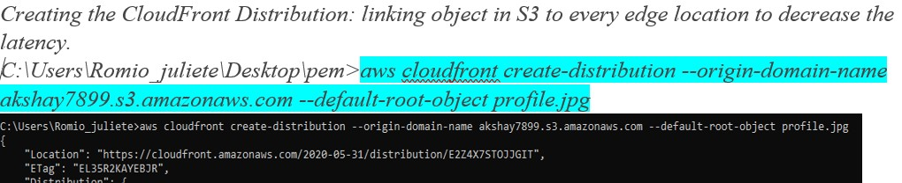

# OS on cloud is your instance.

***

# EBS is like a pendrive, here i use it to store the code. If OS crash, the code can be recovered by attaching it to another instance.

***

# Attaching EBS(pendrive) to OS.

***

# Creating a serverless service S3(very high durability) to store static data.

***

# Cloudfront Distribution to reduce the latency(time to access a server).

